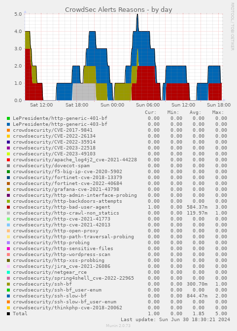
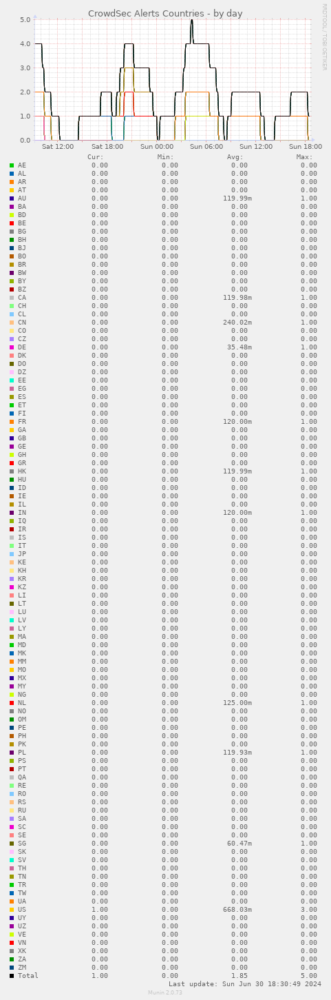

# Munin plugins for crowdsec

This simple code provides [munin](https://munin-monitoring.org/) graphs of the [crowdsec](https://www.crowdsec.net/) activity on your computer.

## License

Free Software Foundation, either version 3 of the License, or (at your option) any later version.

## Setup

Copy the file `crowdsec.py` in `/etc/munin/plugins/` under the names:
- `crowdsec_countries.py`
- `crowdsec_reasons.py`

The Python script gets its data from a file defined by the environment  variable `FILENAME` (for debug) or from `/var/run/munin/crowdsec.raw`.

In my case I generate the file `/var/run/munin/crowdsec.raw` by a cron rule in root crontab:
```
*/5	*	*	*	*	/usr/bin/cscli decisions list -o raw > /var/run/munin/crowdsec.raw
```

## Sample output

### Reasons



### Countries


